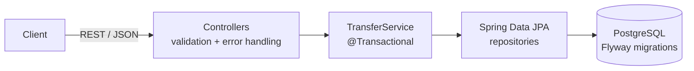

# Payment Ledger

[](https://github.com/Kmsasaleh/payment-ledger/actions/workflows/ci.yml)

A double-entry payment ledger API built with Java and Spring Boot. It moves money between accounts the way real payment systems do: every transfer is recorded as balanced debit and credit entries, retried requests never charge twice, and concurrent transfers can't overdraw an account.

**Live API (interactive docs):** https://payment-ledger-uzmd.onrender.com

## Features

- **Double-entry accounting**: every transaction writes entries that sum to zero, so money is never created or lost
- **Derived balances**: an account's balance is always the sum of its entries, with no balance column that can drift out of sync
- **Idempotent transfers**: clients send an `Idempotency-Key` header, and retries return the original result instead of moving money again
- **Overdraft protection**: user accounts can't go below zero; system accounts (like funding sources) can
- **Concurrency-safe**: pessimistic row locking with consistent lock ordering prevents both overdraft races and deadlocks
- **Integration tests on real Postgres** via Testcontainers, run automatically on every push with GitHub Actions

## Tech stack

Java 21 · Spring Boot 4 · Spring Data JPA / Hibernate · PostgreSQL · Flyway · Testcontainers · JUnit 5 · Docker · GitHub Actions · Render · Neon

## Architecture



The schema has three tables:

| Table | Purpose |
|---|---|
| `accounts` | Buckets that hold money (`USER` or `SYSTEM`), each with a currency |
| `transactions` | One row per business event, with a unique idempotency key |
| `entries` | Signed amounts in cents; each transaction's entries sum to zero |

A $25 transfer from Alice to Bob creates one transaction with two entries: `-2500` on Alice and `+2500` on Bob.

## The concurrency bug, and the fix

The first version of the transfer logic read the sender's balance, checked it, then wrote new entries. Under concurrent load that's a race condition: several requests can read the same balance before any of them commits.

`TransferServiceTest.concurrentTransfersCannotOverdrawAccount` reproduces it. Alice starts with $100 and ten threads each try to send $20 at the same instant. Before the fix, **all ten succeeded** and her balance ended at **-$100**.

The fix locks both account rows with `SELECT ... FOR UPDATE` before checking the balance, so transfers touching the same account run one at a time. Locks are always acquired in a consistent order (smaller account ID first), so two opposite transfers (Alice→Bob and Bob→Alice) can't deadlock each other. After the fix, exactly five transfers succeed and Alice ends at exactly $0.

The commit history shows both steps: the test exposing the bug, then the fix.

## API

The examples use `localhost:8080`. To try the live version, replace it with `https://payment-ledger-uzmd.onrender.com`.

### Create an account

```bash
curl -X POST localhost:8080/accounts \
  -H "Content-Type: application/json" \
  -d '{"name":"Alice","type":"USER","currency":"CAD"}'
```

### Transfer money

```bash
curl -X POST localhost:8080/transfers \
  -H "Content-Type: application/json" \
  -H "Idempotency-Key: alice-bob-1" \
  -d '{"fromAccountId":"<id>","toAccountId":"<id>","amountCents":2500,"description":"Dinner"}'
```

### Get an account and its balance

```bash
curl localhost:8080/accounts/<id>
```

Errors use the standard `ProblemDetail` JSON format: `400` for invalid requests and `422` for insufficient funds.

## Running locally

Requires Java 21 and Docker.

```bash
docker compose up -d        # start Postgres
./mvnw spring-boot:run      # start the API on localhost:8080
```

Flyway creates the schema automatically on startup.

## Running the tests

```bash
./mvnw test
```

Testcontainers starts a throwaway Postgres in Docker, so tests never touch your local data.

## Deployment

The app is packaged as a multi-stage Docker image and deployed on Render, with a managed Neon PostgreSQL database. Database credentials are supplied through environment variables (`DB_URL`, `DB_USERNAME`, `DB_PASSWORD`), so no secrets live in the code. Every push to `main` runs the test suite in GitHub Actions and redeploys automatically.

## Design decisions

- **Money as integer cents (`BIGINT`)**, never floating point, to avoid rounding errors
- **Immutable entries**: mistakes are corrected with new entries, never by editing history
- **Flyway owns the schema**, and Hibernate only validates against it (`ddl-auto=validate`)
- **DTOs (Java records) at the API boundary**, so database entities never leak into the API

## Roadmap

- Clean handling of two simultaneous requests with the same idempotency key
- Reversal transactions
- Reconciliation against an external statement
- API key authentication for the live demo